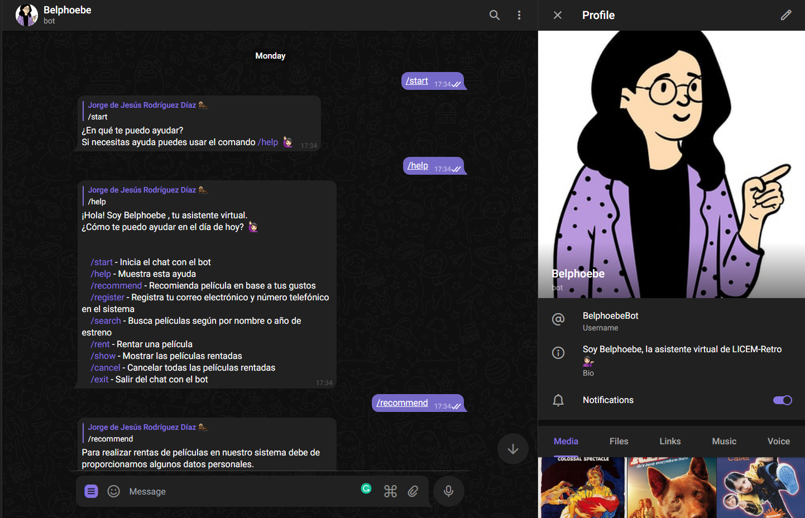

<h1 align="center">Welcome to Belphoebe 👋</h1>

  
  

> Belphoebe is the virtual assistant of LICEM-Retro, her goal is to help you rent films on our platform, where you will find a great diversity of films 💁🏻‍♀️

### 🏠 Homepage

https://t.me/BelphoebeBot

### ✨ Demo

## Author

👤 **jrodriguezdiazz**

* Website: https://www.jrodriguezdiazz.me/
* Twitter: [@jrodriguezdiazz](https://twitter.com/jrodriguezdiazz)
* Github: [@jrodriguezdiazz](https://github.com/jrodriguezdiazz)
* LinkedIn: [@jrodriguezdiazz](https://linkedin.com/in/jrodriguezdiazz)

## 🤝 Contributing

Contributions, issues and feature requests are welcome! Feel free to check [issues page](https://github.com/jrodriguezdiazz/Belphoebe/issues). You can also take a look at the [contributing guide](https://github.com/jrodriguezdiazz/Belphoebe/blob/main/docs/CONTRIBUTING.md).

## 📝 License

Copyright © 2022 [jrodriguezdiazz](https://github.com/jrodriguezdiazz). 
This project is [MIT](https://github.com/jrodriguezdiazz/Belphoebe/blob/main/LICENSE) licensed.

***
_This README was generated with ❤️ by [readme-md-generator](https://github.com/kefranabg/readme-md-generator)_